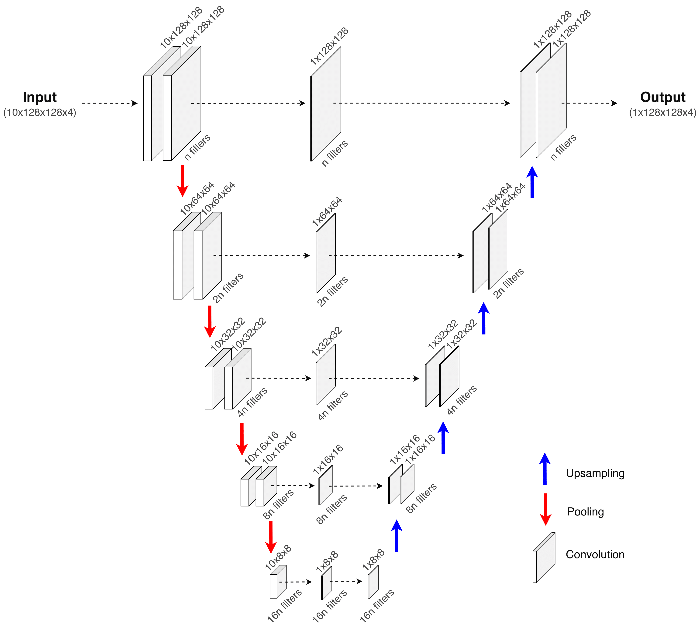

Coastal sea elements prediction with UNet based models
========

Installation
-----

The required modules can be installed  via:

.. code:: bash

    pip install -r requirements.txt

Scripts
-----

Models
-----

Results
-----

(We could add a table with results and a nice gif)

  
Data
-----

In order to download the data, please email to one of the following addresses:

<Addresses>

The data must be downloaded and unzipped inside the 'Data/' directory.

Citation
-----

If you decide to cite our project in your paper or use our data, please use the following bibtex reference:

.. code:: bibtex

    @misc{,
        title={},
        author={},
        year={},
        eprint={},
        archivePrefix={},
        primaryClass={}
    }
