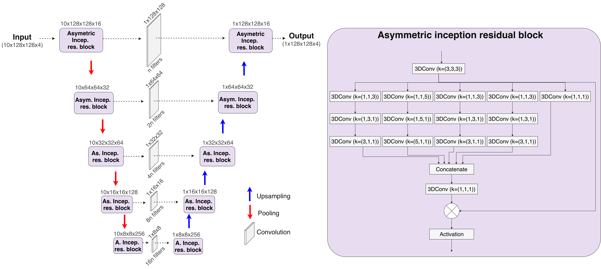

🌊 Deep coastal sea elements forecasting using U-Net based models
========

The official code of the following paper : https://arxiv.org/pdf/2011.03303.pdf

📊 Results
-----

Some animation of the actual vs prediction of the AsymmInceptionRes-3DDR-UNet model, using a 48h ahead prediction:

+-----------------------------+------------------------------------------------------------------------------------+
|       Variable              | Actual  Vs    Prediction                                                           |
+=============================+====================================================================================+
| Sea Surface Height          |.. figure:: figures/ssh.gif                                                         |          
+-----------------------------+------------------------------------------------------------------------------------+
| Sea Water Salinity          |.. figure:: figures/sal.gif                                                         |
+-----------------------------+------------------------------------------------------------------------------------+
| Eastward Current Velocity   |.. figure:: figures/cur_uo.gif                                                      |
+-----------------------------+------------------------------------------------------------------------------------+
| Northward Current Velocity  |.. figure:: figures/cur_vo.gif                                                      |          
+-----------------------------+------------------------------------------------------------------------------------+

Note: the dark area is made of pixels that correspond to the land.

💻 Installation
-----

The required modules can be installed  via:

.. code:: bash

    pip install -r requirements.txt
    
Quick Start
~~~~~~~~~~~
To launch the training, please run:

.. code:: bash

    python train_selected_model.py 

📜 Scripts
-----

- The scripts contain the models, the data preprocessing, as well as the training files.

🔍 Models
-----

We show here the schema related to the AsymmInceptionRes-3DDR-UNet model.

  
📂 Data
-----

In order to download the data, please email to the following addresses:

j.garciafernandez@student.maastrichtuniversity.nl

i.alaouiabdellaoui@student.maastrichtuniversity.nl

siamak.mehrkanoon@maastrichtuniversity.nl

The data must be downloaded and unzipped inside the 'Data/' directory.

🔗 Citation
-----

If you use our data and code, please cite the paper using the following bibtex reference:

.. code:: bibtex

    @article{Fernández2020coastal,
        title={Coastal sea elements prediction using U-Net based models},
        author={García Fernández, Jesús and Alaoui Abdellaoui, Ismail and Mehrkanoon, Siamak},
        journal={arXiv preprint arXiv:2011.03303},
        year={2020}
    }
